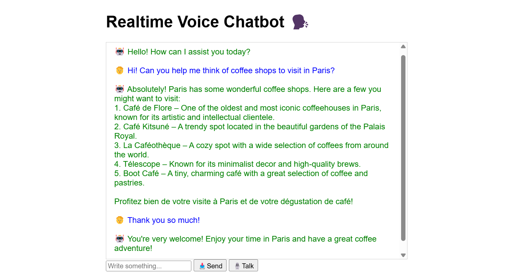

# 🗣️ Realtime Voice Chatbot

This is a personal project to develop a local application using FastAPI that interacts with OpenAI's Realtime API. The app allows users to communicate either via text (already implemented) or voice (currently under development).

## ✨ Features

- Text-based conversation with OpenAI's Realtime API
- Voice-based interaction using WebSocket streaming and VAD (**in progress**)
- FastAPI backend for serving the application
- Environment variables managed via `.env` file (not pushed to github, but .env.example provided)

## 🧰 Tech Stack

- **FastAPI** — Web framework for building APIs
- **Uvicorn** — ASGI server to run the FastAPI app
- **OpenAI API** — OpenAI Realtime API for real-time interaction
- **Python** — Main programming language
- **HTML** — Simple frontend for user interaction
- **WebSocket** — For real-time communication
- **PyAudio** — For handling audio input/output

## 🚀 Installation

1. Clone the repository:

   ```bash
   git clone https://github.com/csierr/realtime-voice-chatbot.git
   cd realtime-voice-chatbot

2. Create and activate a virtual environment:

    ```bash
    python -m venv .venv
    source .venv/Scripts/activate  # Windows
    source .venv/bin/activate      # Linux/Mac

3. Install dependencies:

    ```bash
    pip install -r requirements.txt

4. Create a `.env` file based on `.env.example`, and insert your OpenAI API key.


## ⚡ Usage

Access the app at http://localhost:8000  after running the backend locally:

```bash
uvicorn src.main:app --reload
```

## 🚧 Project Status

This project is a work in progress:

✅ Text conversation with OpenAI is functional

🛠 **Voice conversation module is under active development**

📝 More features and improvements planned


# 🖼️ Preview

Here’s a preview of the app in action!

