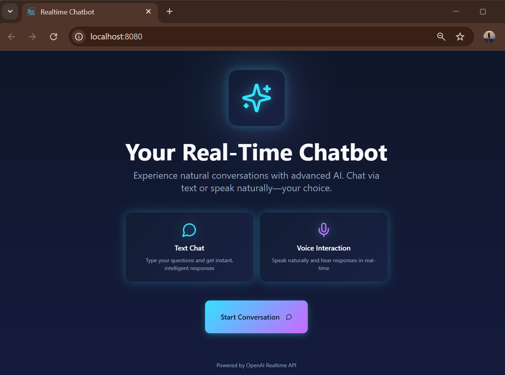
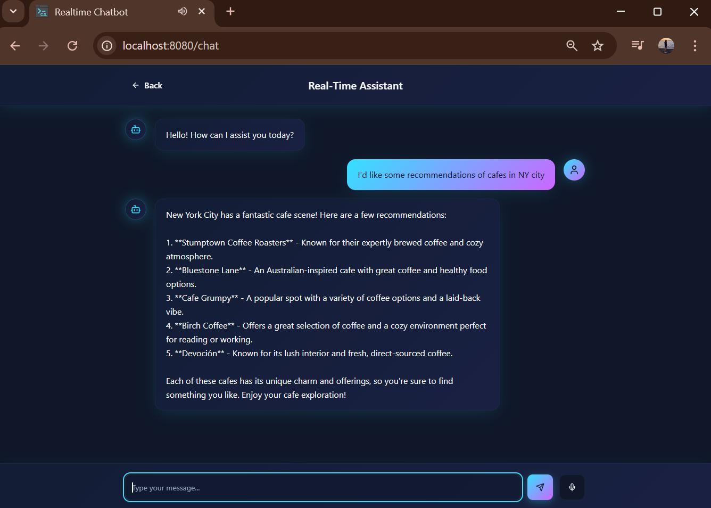

# 🗣️ Realtime Voice Chatbot

This is a personal project to develop a local application using FastAPI and React that interacts with OpenAI's Realtime API. The app allows users to chat via text and receive spoken responses from the AI.

## ✨ Features

- Text chat with OpenAI's Realtime API
- Buffered audio playback that receives audio chunks via WebSocket and plays them after full reception
- WebSocket communication between frontend (React) and backend (FastAPI)
- FastAPI backend serving the WebSocket endpoint
- React frontend built with Vite and styled with Tailwind CSS
- Environment variables managed via `.env` file

## 📁 Project Structure

```
realtime-voice-chatbot/
├── backend/
│   ├── my_realtime_client.py
│   ├── websocket_server.py
│   └── utils.py
├── src/
│   ├── components/
│   ├── hooks/
│   ├── pages/
│   ├── App.tsx
│   └── main.tsx
├── images/
├── index.html
├── .env.example
├── requirements.txt
├── package.json
└── readme.md
```

## 🧰 Tech Stack

- **Backend**: FastAPI, Uvicorn, OpenAI API, Python, WebSockets
- **Frontend**: React, TypeScript, Vite, Tailwind CSS

## 🚀 Installation

1.  **Clone the repository:**
    ```bash
    git clone https://github.com/csierr/realtime-voice-chatbot.git
    cd realtime-voice-chatbot
    ```

2.  **Set up the Backend:**
    - Create and activate a virtual environment:
      ```bash
      python3 -m venv .venv         # Linux/Mac
      source .venv/bin/activate     # Linux/Mac
      ```
    - Install backend dependencies. If not already installed, you may need to add `portaudio19-dev` and `ffmpeg`.
      ```bash
      sudo apt-get update; sudo apt-get install -y portaudio19-dev
      sudo apt-get update; sudo apt-get install -y ffmpeg
      pip install -r requirements.txt
      ```

3.  **Set up the Frontend:**
    - Install frontend dependencies:
      ```bash
      npm install
      ```

4.  **Configure Environment Variables:**
    - Create a `.env` file in the root directory based on `.env.example`, and insert your OpenAI API key.

## ⚡ Usage

You will need to run the backend and frontend servers in two separate terminals.

1.  **Run the backend server:**
    ```bash
    uvicorn backend.websocket_server:app --reload
    ```

2.  **Run the frontend development server:**
    ```bash
    npm run dev
    ```

3.  **Access the application:**
    - Open your browser and go to `http://localhost:8080`.

## 🚧 Project Status

This project is a work in progress:

✅ Text conversation with OpenAI is functional
✅ Audio reception & playback is functional
🛠️ Audio input from the browser **is under development**

The current audio implementation buffers chunks and starts playback only after the final `audio_done` signal is received.

# 🖼️ Preview

Here’s a preview of the app in action!

In the screenshot, you can see the app running, with the terminal/console (opened via F12) visible to monitor logs and see what's happening behind the scenes in real time.


