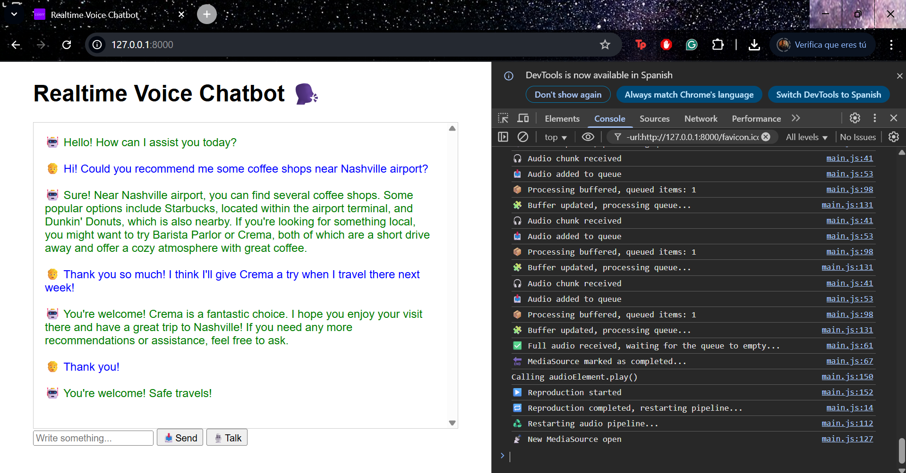

# 🗣️ Realtime Voice Chatbot

This is a personal project to develop a local application using FastAPI that interacts with OpenAI's Realtime API. The app allows users to chat via text (already implemented) and voice (**under development**).

## ✨ Features

- Text chat with OpenAI's Realtime API
- Buffered audio playback that receives audio chunks via WebSocket and plays them after full reception
- WebSocket communication between frontend and backend
- FastAPI backend serving both HTML and WebSocket endpoints
- Environment variables managed via `.env` file (not pushed to github, but .env.example provided)

Claro, aquí tienes la estructura del proyecto correctamente formateada en Markdown:


## 📁 Project Structure

```
realtime-voice-chatbot/
├── .env.example
├── chatbot-screenshot.png
├── .gitignore
├── requirements.txt
├── README.md
├── src/
│   ├── websocket_server.py
│   └── my_realtime_client.py
└── public/
    ├── index.html
    ├── favicon-32x32.png
    ├── css/
    │   └── styles.css
    └── js/
        └── main.cjsss
```


## 🧰 Tech Stack

- **FastAPI** — Web framework for building APIs
- **Uvicorn** — ASGI server to run the FastAPI app
- **OpenAI API** — OpenAI Realtime API for real-time interaction
- **Python** — Main programming language
- **HTML** — Simple frontend for user interaction
- **WebSocket** — For real-time communication
- **PyAudio** — For handling audio input/output

## 🚀 Installation

1. Clone the repository:

   ```bash
   git clone https://github.com/csierr/realtime-voice-chatbot.git
   cd realtime-voice-chatbot

2. Create and activate a virtual environment:

    ```bash
    python -m venv .venv
    source .venv/Scripts/activate  # Windows
    source .venv/bin/activate      # Linux/Mac

3. Install dependencies:

    ```bash
    pip install -r requirements.txt

4. Create a `.env` file based on `.env.example`, and insert your OpenAI API key.


## ⚡ Usage

Access the app at http://localhost:8000  after running the backend locally:

```bash
uvicorn src.websocket_server:app --reload
```

When you access the app you need to **click anywhere on the page to enable audio playback**. This is due to restrictions in modern browsers, which block media playback automatically until the user interacts with the page. Once you click, the audio playback functionality should work as expected.

## 🚧 Project Status

This project is a work in progress:

✅ Text conversation with OpenAI is functional

✅ Audio reception & playback

🛠 Audio input from browser **is under active development**

📝 More features and improvements planned

The current audio implementation buffers chunks and starts playback only after the final `audio_done` signal is received. True streaming playback is not yet supported.


# 🖼️ Preview

Here’s a preview of the app in action!

In the screenshot, you can see the app running, with the terminal/console (opened via F12) visible to monitor logs and see what's happening behind the scenes in real time.

